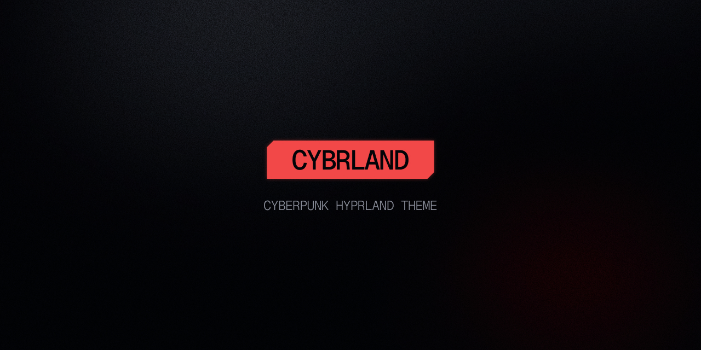

Collection of themes for Hyprland, Waybar, kitty and micro inspired by the color palette popularized by **Cyberpunk 2077**.

> [!CAUTION]
> Theme for **Hyprland** is still work in progress and was not made with other users in mind. 

## Prerequisites
- `GeistMono Nerd Font` (download [from here](https://www.nerdfonts.com/font-downloads))
- hwmon (for waybar to display CPU, GPU and RAM)
- [rofi](https://github.com/davatorium/rofi) (launcher)
- [swaync](https://github.com/ErikReider/SwayNotificationCenter) (notifications)
- [topgrade](https://github.com/topgrade-rs/topgrade) (for upgrades)
- [pulseaudio](https://github.com/pulseaudio/pavucontrol) (to control audio)
- [PipeWire](https://archlinux.org/packages/extra/x86_64/pipewire/) (to control audio with keyboard wheel)
- [Sidebery](https://github.com/mbnuqw/sidebery) (vertical tabs extension for Firefox)

## Status
### Done
- [x] Waybar
- [x] kitty
- [x] micro
### Alpha
- [ ] Hyprland (Alpha)
### WIP
- [ ] Obsidian (not included)
- [ ] Firefox ()
