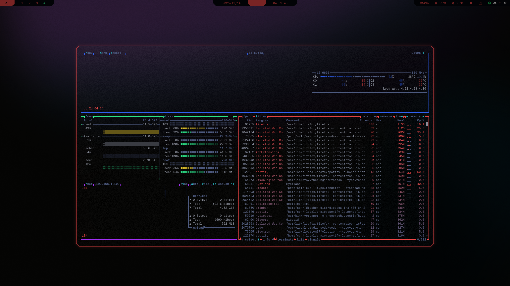

# Cybrtop
Color theme for btop inspired by the color palette popularized by **Cyberpunk 2077**.

## Result
</td>

## What to do
### 1. Create theme file

```sh
micro ~/.config/btop/themes/cybrtop.theme
```

### 2. Insert [cybrtop.theme](../btop/cybrtop.theme)

### 3. Set theme
```sh
btop

# Press ESC -> Options -> Theme, select cybrtop.theme
```