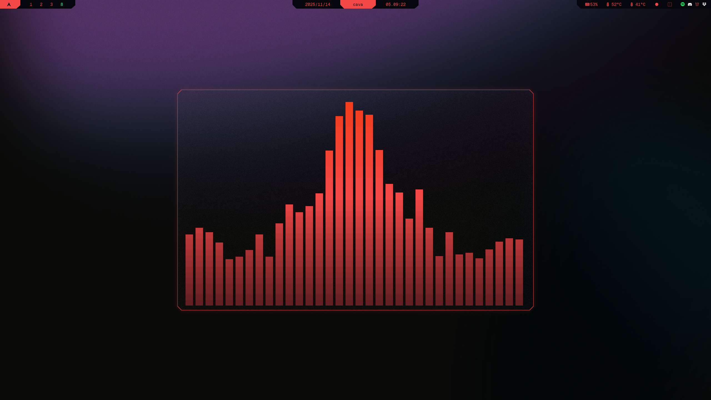

# Cybrcava
Color theme for cava inspired by the color palette popularized by **Cyberpunk 2077**.

## Result
</td>

## What to do
### 1. Create theme file

```sh
micro ~/.config/cava/config
```

### 2. Insert [cybrcava](../cava/config)

### 3. Run cava
```sh
cava
```