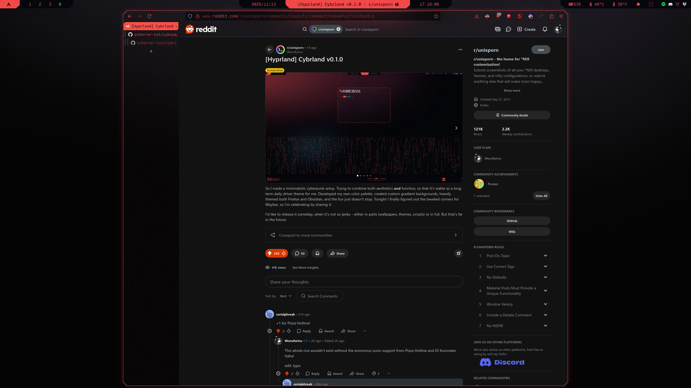

# Cybrfox (WIP)
Theme for Firefox browser inspired by the color palette popularized by **Cyberpunk 2077**.

> [!CAUTION]
> This theme is still work in progress and was not made with other users in mind.
> It also uses deprecated version of [Cybrcolors](https://github.com/scherrer-txt/cybrcolors)

## Result
</td>

## What to do
### Install `GeistMono Nerd Font` ([from here](https://www.nerdfonts.com/font-downloads))

### Download `userChrome.css` and `sideberry.css`
  - `userChrome.css` contains all **decoration** setting
  - `sideberry.css` contains all **decorations** for Sidebery, paste its content into its Style Editor