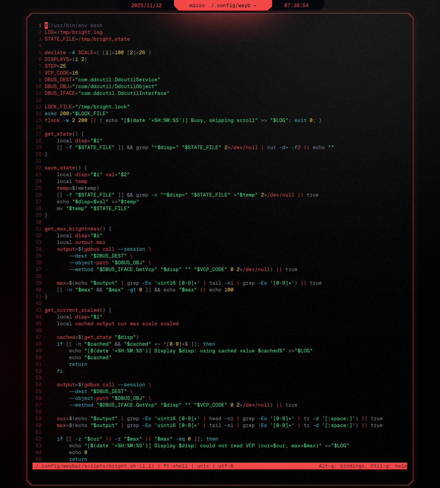

# Cybrkitty
Color palette for Kitty inspired by the color palette popularized by **Cyberpunk 2077**.

## Result
</td>

## What to do
### 1. Create theme file

```sh
micro ./.config/kitty/themes/cybrkitty.conf
```

### 2. Insert [cybrkitty.conf](/kitty/cybrkitty.conf)

### 3. Set theme
```sh
include themes/cybrkitty.conf
```