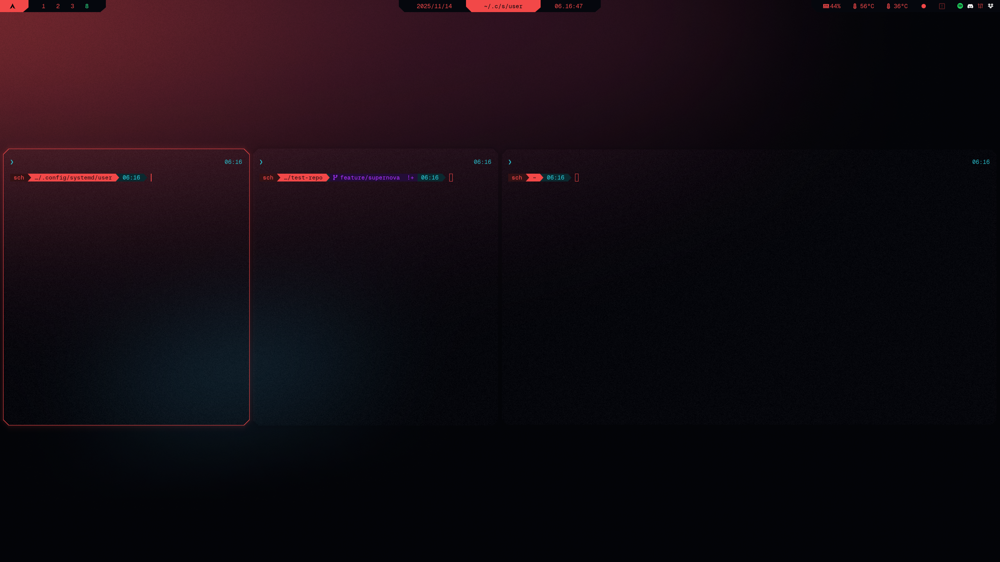

# Cybrship
Color prompt for Starship inspired by the color palette popularized by **Cyberpunk 2077**.

> [!CAUTION]
> This theme is still work in progress, there are some bugs to be fixed. 

## Result
</td>

## What to do
### 1. Enable transcience in fish

```sh
micro ~/.config/fish/config.fish
```

#### Insert:

```json
enable_transience
function starship_transient_prompt_func
  starship module character
end
function starship_transient_rprompt_func
  starship module custom.transient_time
end
starship init fish | source
```
#### Restart 
```sh
exec fish
```

### 2. Open config

```sh
micro ~/.config/starship.toml
```
### 3. Insert [cybrship](../starship/starship.toml)

### 4. Check

```bash
which starship
starship explain
starship print-config | head -n 5

# Should explain and display starship.toml config
```

#### If not:

```bash
echo $STARSHIP_CONFIG

# Should point to ~/.config/starship.toml
```

#### Then run:

```bash
set -gx STARSHIP_CONFIG ~/.config/starship.toml
starship init fish | source
```
