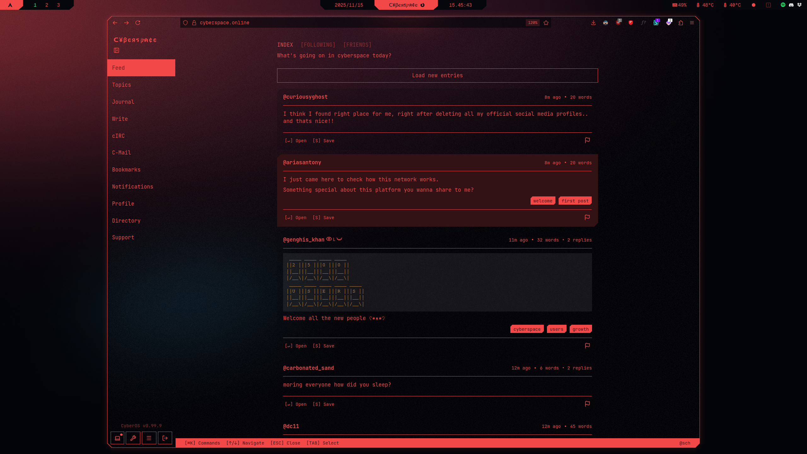

# Stylus themes
Custom themes for singular webpages for the Stylus extension inspired by the color palette popularized by **Cyberpunk 2077**.

## Result
</td>

## What to do
### 1. Download and install [Stylus](https://github.com/openstyles/stylus)
### 2. Click the extension icon in your toolbar
### 3. Click on "Write style for: [name of the website]"
### 4. Paste theme inside
#### Themes:
- [Cybrspace.online](../stylus/cyberspace.online)

## Status
### Done
- [x] Cyberspace.online

### WIP (not included)
- [ ] YouTube
- [ ] Reddit
- [ ] Gmail
- [ ] ChatGPT
- [ ] GoogleDrive
- [ ] Anilist
- [ ] Mastodon
- [ ] Threads
