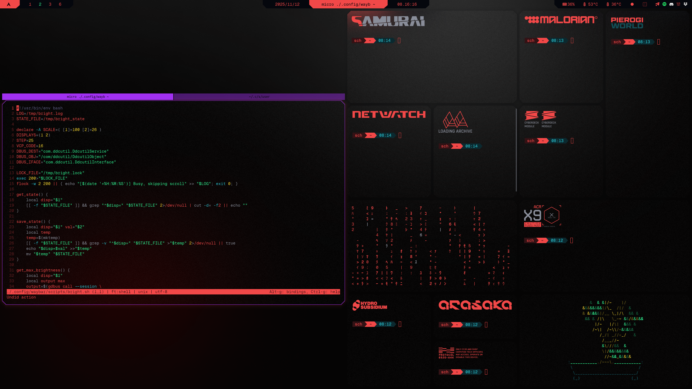

# Cybrbar
Theme for Waybar inspired by the color palette popularized by **Cyberpunk 2077**.

## Result
</td>

## What to do
### 1. Install `GeistMono Nerd Font` ([from here](https://www.nerdfonts.com/font-downloads))

### 2. Download `config.jsonc`, `modules.jsonc`, `bright.sh` and `bright-status.sh`
  - `config.jsonc` contains all **functional** setting
  - `modules.jsonc` contains all **modules** for all bars
  - `bright.sh` is a script which enables you to control screen brightness on desktop via mousescroll
  - `bright-status.sh` is and accessory script which outputs the values in percentage and corresponding icon to Waybar

### 3. File structure should look like this
```code
waybar/
    config.jsonc
    modules.jsonc
    scripts/
            bright.sh
            bright-status.sh
    svg/
            gr0-left.svg
            gr0-right.svg
            no1-left.svg
            no1-right.svg
            re0-left.svg
            re0-right.svg
            re1-left.svg
            re1-right.svg
```
### 4. Create a backup of your old config and modules

### 5. Restart Waybar
```sh
killall waybar
```